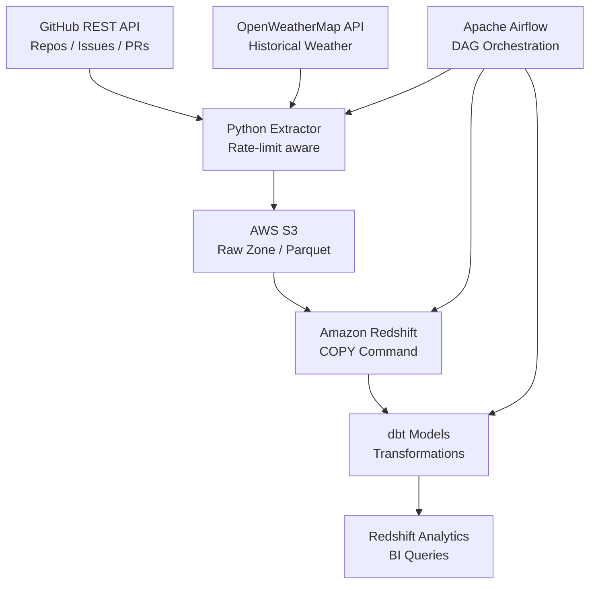

# Batch Ingestion Pipeline — GitHub + Weather APIs → Redshift


Automated batch ingestion pipeline that extracts data from GitHub REST API and OpenWeatherMap API, stages to S3, and loads into Amazon Redshift using the COPY command. Orchestrated by Apache Airflow with daily scheduling and incremental loads.

## Architecture



## Features

- Paginated extraction from GitHub API with rate-limit handling
- Parallel weather data collection across multiple locations
- S3 staging with Parquet format for efficient COPY loads
- Incremental ingestion with watermark-based deduplication
- dbt transformation layer on top of Redshift
- Airflow DAGs with retry logic and Slack alerting on failure

## Tech Stack

| Layer | Technology |
|-------|-----------|
| Extraction | Python (requests, aiohttp) |
| Staging | AWS S3 (Parquet) |
| Load | Amazon Redshift COPY |
| Transform | dbt Core |
| Orchestration | Apache Airflow 2.x |
| Infrastructure | Docker Compose |

## Prerequisites

- Docker & Docker Compose
- AWS credentials (S3 + Redshift access)
- GitHub Personal Access Token
- OpenWeatherMap API Key

## Quick Start

```bash
git clone https://github.com/zulham-tech/batch-ingestion-github-weather-redshift.git
cd batch-ingestion-github-weather-redshift
cp .env.example .env  # fill in API keys and AWS credentials
docker compose up -d
# Access Airflow at http://localhost:8080
```

## Project Structure

```
.
├── dags/                # Airflow DAG definitions
├── extractors/          # GitHub & Weather API clients
├── loaders/             # S3 uploader & Redshift COPY
├── dbt/                 # dbt models & tests
├── schemas/             # Redshift DDL scripts
├── docker-compose.yml
└── requirements.txt
```

## Author

**Ahmad Zulham** — [LinkedIn](https://linkedin.com/in/ahmad-zulham-665170279) | [GitHub](https://github.com/zulham-tech)
